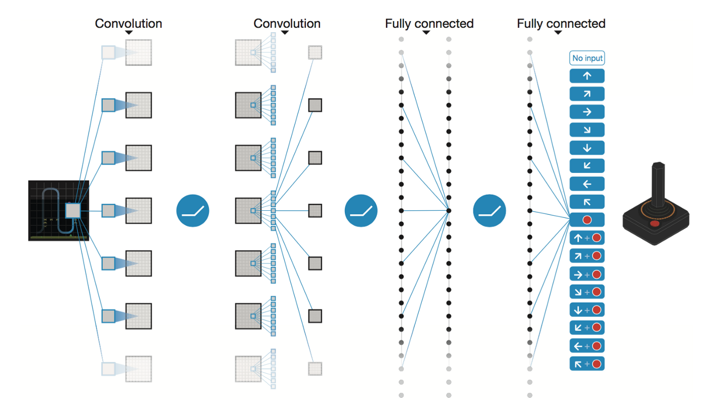
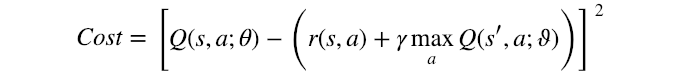
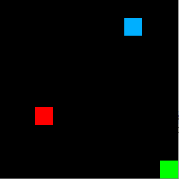
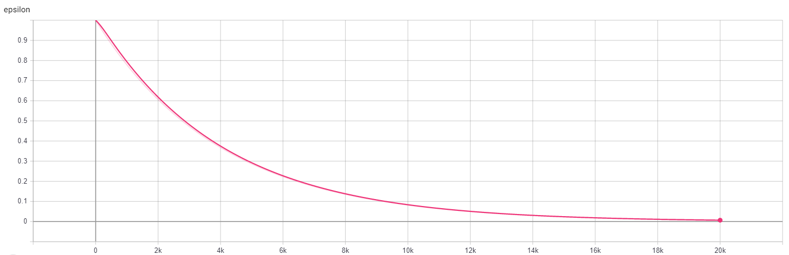
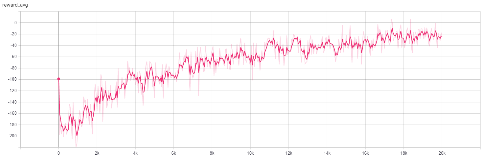
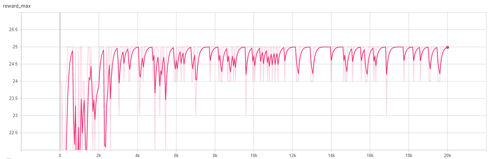
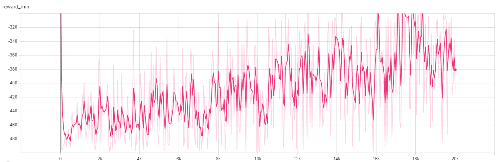
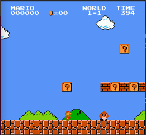

# CNN and RL for a Simple Game



# Objectives
#### Build a CNN which can
* Take each frame of the game as an input state S
* Output the action socre for each possible action A
* Take the best action based on (S,A) pair which maximize the reward


# Methodology
### 1. Convolutional Nerual Network
* input image from game frame
* output (9) action values for all actions in action_space


```python
model = Sequential()

model.add(Conv2D(64, (3, 3), input_shape=(210, 160, 3)))
model.add(Activation('relu'))
model.add(MaxPooling2D(pool_size=(2, 2)))
model.add(Dropout(0.2))

model.add(Conv2D(64, (3, 3)))
model.add(Activation('relu'))
model.add(MaxPooling2D(pool_size=(2, 2)))
model.add(Dropout(0.2))

model.add(Flatten()) 
model.add(Dense(32))

model.add(Dense(9, activation='linear'))  
```

### 2. Reinforcement Learing
* Update CNN predicted (S,A) value based on the newly observed data (S', reward ...)


#### Reinforcement Learing Tricks 1
* Double Network
* ϑ represents the semi-constant weights
* θ represents the dynamic weights



#### Reinforcement Learing Tricks 2
* Experience replay: store transitions in replay memeory
* Randomly draw minibatch to perform SGD

#### Reinforcement Learing Tricks 3
* Exploration with epilson-greedy approach
* Epilson decay from 1 to ~0

### 3. Customized Gym
* Environment simulator
* Provide input images, reward, actions, etc.
* ENEMY_PENALTY = -300
* FOOD_REWARD = +25
* ACTION_SPACE_SIZE = 9
* Agent = Blue; Food = Green; Enemy = Red



# Results
### Initial model
* Randomly exploring the map

### After few episodes...... 
* Start to find some parttern

### Trainning Summary









# Future outlook
### More complex games!
* Such as super mori ganme or pacman, where I got stacked.....




